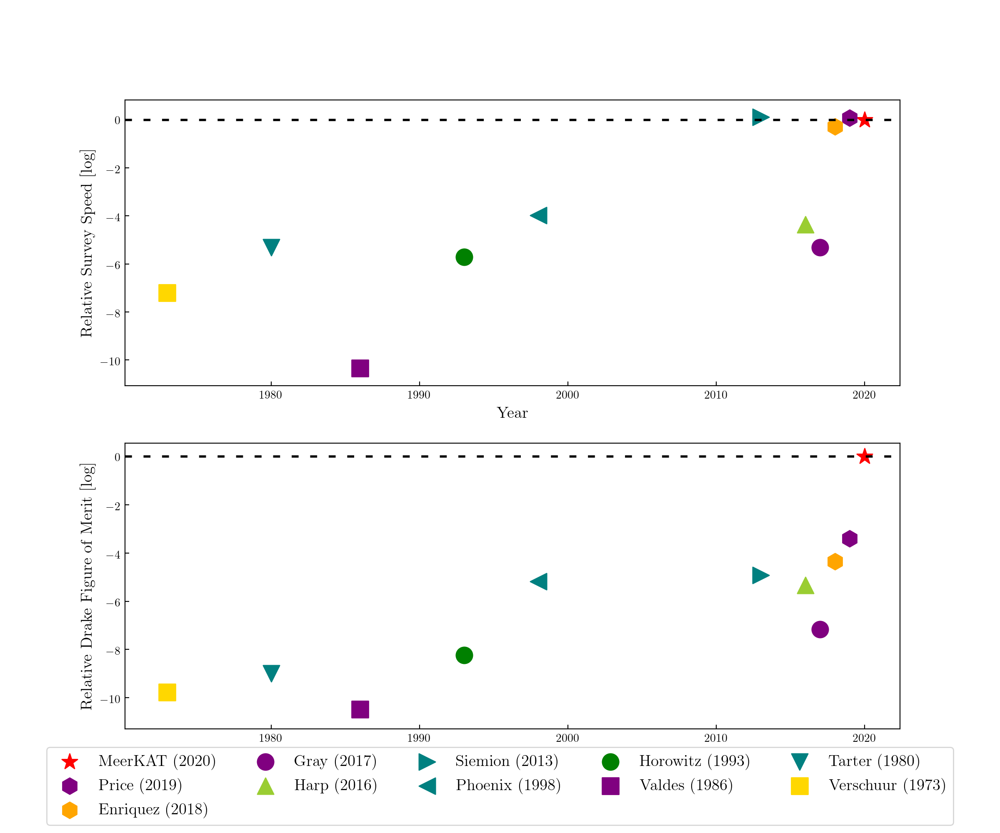
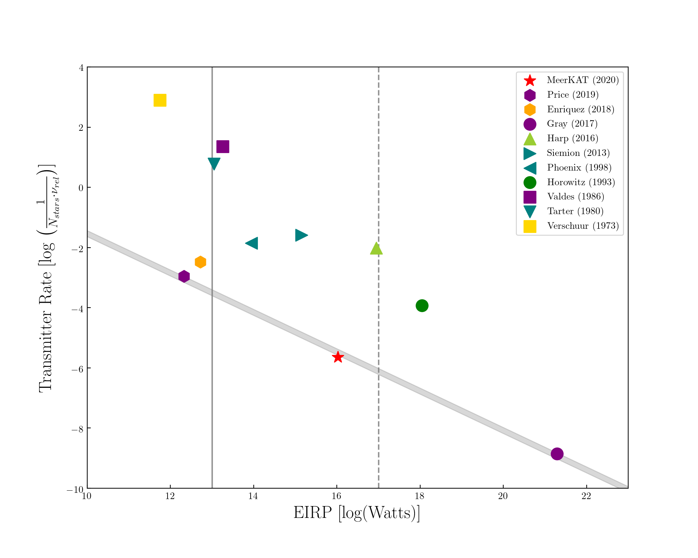

# Breakthrough Listen: Target Scheduling for the MeerKAT Commensal Technosignature Search

One of Breakthrough Listen’s primary objectives is to conduct the most comprehensive radio-frequency search for evidence of intelligent life thus far, observing 1 million nearby stars and other objects [1]. [MeerKAT](https://www.ska.ac.za/gallery/meerkat/), the SKA precursor inaugurated last year in South Africa, is one of several instruments crucial to attaining this goal. The data from the array may be tapped off at different processing stages by many users simultaneously through subscription to data streams. This architecture provides a rare opportunity for commensal SETI observing on an array telescope. The Breakthrough Listen program on MeerKAT will be primarily commensal, and the first 16 of an eventual 128 servers have already been installed in the on-site data center at the telescope. This project will address an important component of Breakthrough Listen’s program on MeerKAT - identifying the set of targets that can be observed through commensal beamforming during particular primary science observations.

## MeerKAT Target Selector

## Figures of Merit

## Author

This project is being developed by Tyler Cox, under the mentorship of Daniel Czech and Dave MacMahon, for the Berkeley SETI Research Center [internship](http://seti.berkeley.edu/Internship.html).

## References

[1] Isaacson, Howard, et al. "The Breakthrough Listen search for intelligent life: Target selection of nearby stars and galaxies." https://arxiv.org/pdf/1701.06227.pdf

[2] https://github.com/danielczech/meerkat-backend-interface.git forked from https://github.com/ejmichaud/meerkat-backend-interface

[3] Enriquez, J. Emilio, et al. "The Breakthrough Listen search for intelligent life: 1.1–1.9 GHz observations of 692 nearby stars." https://arxiv.org/pdf/1709.03491.pdf

[4] SETI and the Square Kilometre Array https://arxiv.org/abs/1412.4867
